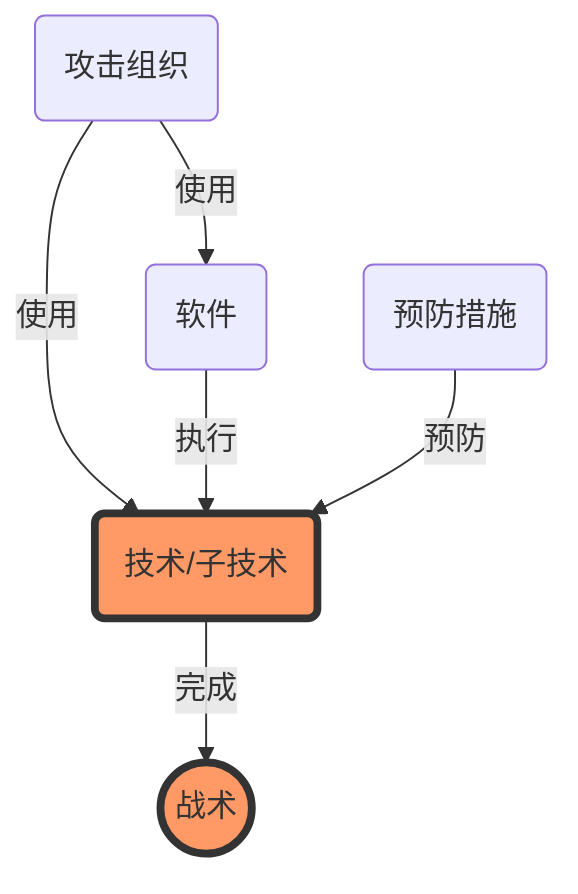
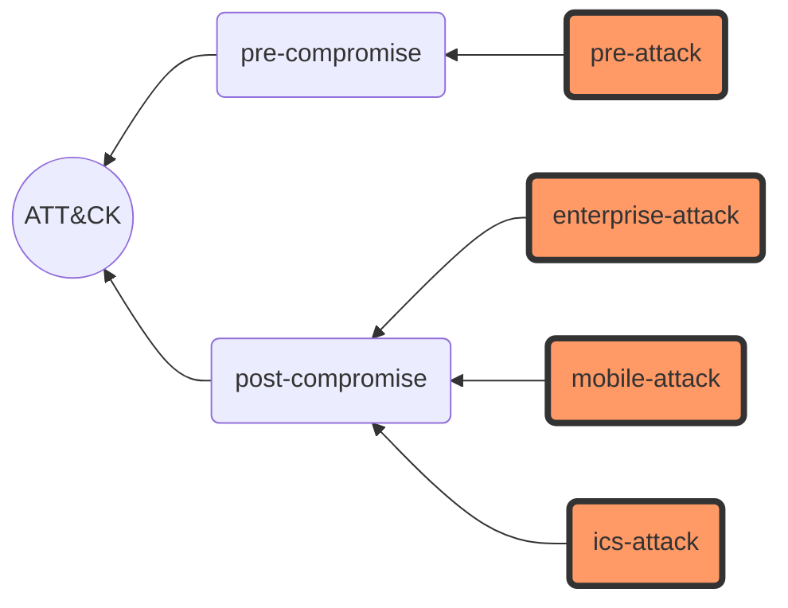
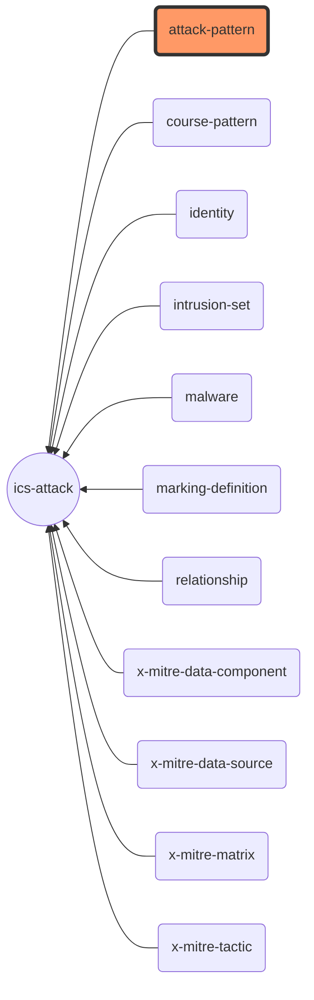
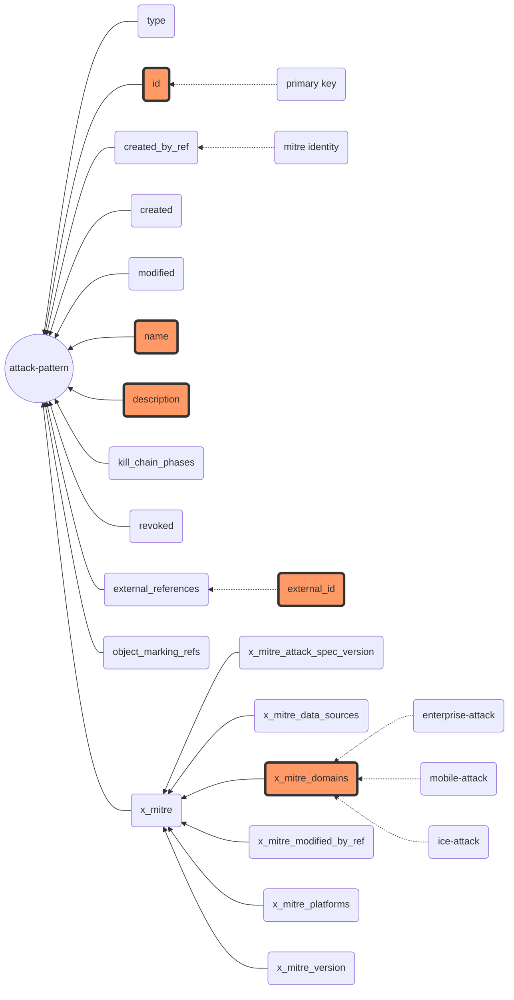
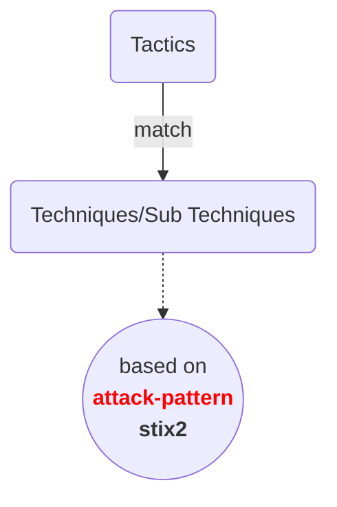
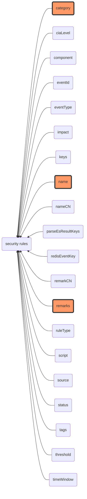

# preface

分类框架和匹配方法在本项目中可以分开来，耦合度可以非常低

```mermaid
flowchart TB
	subgraph <b>安全规则匹配系统的设计与开发
		A(安全规则) --> B(匹配方法)
		B --低耦合--> C(分类框架)
	end
	
	classDef orange fill:#f96,stroke:#333,stroke-width:4px
	class B,C orange
```

本项目的分类框架是站在巨人的肩膀上：基于已有 json 元数据源 + stix2, pandas 工具实现的，但以下说明未进行细节的技术阐述，仅仅站在抽象层面提供一份人人都可以理解的分类框架

*注：遵循 mermaid 规范构建的流程图，查看请完成相关配置或借助 Typora 等内嵌了该功能的工具*

# 1.ATT&CK



|  战术1  |  战术2  |  ……  |  战术n  |
| :-----: | :-----: | :--: | :-----: |
| 技术1.1 | 技术2.1 |  ……  | 技术n.1 |
|   ……    |   ……    |  ……  | 技术n.2 |
| 技术1.3 |   ……    |  ……  |         |
|         | 技术2.4 |  ……  |         |

<b>元数据 <i>vs</i> 元数据</b>

## pre-compromise

“pre-compromise”攻击是指通过网络钓鱼、受感染的网站、凭据收集以及对凭据的暴力破解事件

### pre-attack

- **attack-pattern**
- identity
- intrusion-set
- marking-definition
- relationship
- x-mitre-matrix
- x-mitre-tactic

## post-compromise

“post-compromise”攻击包括保持受感染的网络、窃取数据或破坏IT系统等事件

### enterprise-attack

- **attack-pattern**
- course-of-action(mitigation)
- identity
- intrusion-set
- malware(group)
- marking-definition
- relationship
- tool
- x-mitre-data-component
- x-mitre-data-source
- x-mitre-matrix
- x-mitre-tactic

### mobile-attack

- **attack-pattern**
- course-of-action(mitigation)
- identity
- intrusion-set
- malware(group)
- marking-definition
- relationship
- tool
- x-mitre-matrix
- x-mitre-tactic

### ics-attack

- **attack-pattern**
- course-of-action(mitigation)
- identity
- intrusion-set(group)
- malware
- marking-definition
- relationship
- x-mitre-data-component
- x-mitre-data-source
- x-mitre-matrix
- x-mitre-tactic

## conclusion



Q: Why classified?

A: 

- ATT&CK
- ICS
- 检查的方法是通用的，而战术因为平台的差异性很少是全平台通用的 Generalization, Fine-Grain, Accuracy

# 2.ics-attack



## conclusion

attack-pattern

# 3.attack-pattern



注：pre-attack 没有 x_mitre_domains，明明有 attack-pattern 的 json 文件

# Conclusion

## （1）Goals



注：attack-pattern 是汇总了较多数据源后的统一标识(stix2)，类似于国际通用语：中国人和俄国人之间用英语交流，Tactic 和 Matrix 等是 mitre 新增的

| ATT&CK concept                                               | STIX object type                                             | Custom type? |
| ------------------------------------------------------------ | ------------------------------------------------------------ | ------------ |
| [Matrix](https://github.com/mitre/cti/blob/master/USAGE.md#matrices) | `x-mitre-matrix`                                             | yes          |
| [Tactic](https://github.com/mitre/cti/blob/master/USAGE.md#tactics) | `x-mitre-tactic`                                             | yes          |
| [Technique](https://github.com/mitre/cti/blob/master/USAGE.md#techniques) | [attack-pattern](http://docs.oasis-open.org/cti/stix/v2.0/csprd01/part2-stix-objects/stix-v2.0-csprd01-part2-stix-objects.html#_Toc476230921) | no           |
| [Sub-technique](https://github.com/mitre/cti/blob/master/USAGE.md#sub-techniques) | [attack-pattern](http://docs.oasis-open.org/cti/stix/v2.0/csprd01/part2-stix-objects/stix-v2.0-csprd01-part2-stix-objects.html#_Toc476230921) where `x_mitre_is_subtechnique = true` | no           |
| [Procedure](https://github.com/mitre/cti/blob/master/USAGE.md#procedures) | [relationship](https://docs.oasis-open.org/cti/stix/v2.0/csprd01/part2-stix-objects/stix-v2.0-csprd01-part2-stix-objects.html#_Toc476230970) where `relationship_type = "uses"` and `target_ref` is an `attack-pattern` | no           |
| [Mitigation](https://github.com/mitre/cti/blob/master/USAGE.md#mitigations) | [course-of-action](https://docs.oasis-open.org/cti/stix/v2.0/csprd01/part2-stix-objects/stix-v2.0-csprd01-part2-stix-objects.html#_Toc476230929) | no           |
| [Group](https://github.com/mitre/cti/blob/master/USAGE.md#groups) | [intrusion-set](https://docs.oasis-open.org/cti/stix/v2.0/csprd01/part2-stix-objects/stix-v2.0-csprd01-part2-stix-objects.html#_Toc476230941) | no           |
| [Software](https://github.com/mitre/cti/blob/master/USAGE.md#software) | [malware](http://docs.oasis-open.org/cti/stix/v2.0/csprd01/part2-stix-objects/stix-v2.0-csprd01-part2-stix-objects.html#_Toc476230945) or [tool](http://docs.oasis-open.org/cti/stix/v2.0/csprd01/part2-stix-objects/stix-v2.0-csprd01-part2-stix-objects.html#_Toc476230961) | no           |
| [Data Source](https://github.com/mitre/cti/blob/master/USAGE.md#data-source) | `x-mitre-data-source`                                        | yes          |

增加的两种：

| STIX object type                                             | About                                                        |
| ------------------------------------------------------------ | ------------------------------------------------------------ |
| [identity](https://docs.oasis-open.org/cti/stix/v2.0/csprd01/part2-stix-objects/stix-v2.0-csprd01-part2-stix-objects.html#_Toc476230933) | Referenced in the `created_by_ref` of all objects to state that the MITRE Corporation created the object |
| [marking-definition](https://docs.oasis-open.org/cti/stix/v2.0/csprd01/part1-stix-core/stix-v2.0-csprd01-part1-stix-core.html#_Toc476227338) | Referenced in the `object_marking_refs` of all objects to express the MITRE Corporation copyright |

## （2）Fine-Grain

### ① 一级分类

- pre-attack
- enterprise-attack
- mobile-attack
- ics-attack

### ② 二级分类

- attack-pattern

### ③ 三级分类

- id(attack-pattern id)
- **name**
- **description**
- external_references 中的 external_id (mitre att&ck id, capec id 等)
- x_mitre_domains(一级分类标签，万一不知道/不确定平台、全局搜索，直接从二级分类开始也是支持的，那这一属性在最后的报告结果输出中就是有必要的，最重要的是分类框架的完整性，如果后续再去重构会比较麻烦)

注：也存在 external_references 中没有 external_id 的情况，即没有被 mitre att&ck 收录

# 4.security rules



# Question

- 是否以单一的 mitre att&ck id 作为匹配结果输出(tags, one or more)；如果输出可解释性的报告，需要哪些输出，仅 id？若拓展，需在三级分类中增加
- 元数据  vs 元数据，cti 没有提供中文，英文？中文/德文，需要翻译的话问题会更复杂
- more security rules samples？自己总结还是公开数据源？
- 打个预防针：accuracy depends on description like search engine
- weight: eg.category > name > remark

# appendix

## Json

```json
{
  "x_mitre_platforms": [
    "Field Controller/RTU/PLC/IED",
    "Device Configuration/Parameters"
  ],
  "x_mitre_domains": [
    "ics-attack"
  ],
  "object_marking_refs": [
    "marking-definition--fa42a846-8d90-4e51-bc29-71d5b4802168"
  ],
  "type": "attack-pattern",
  "id": "attack-pattern--008b8f56-6107-48be-aa9f-746f927dbb61",
  "created_by_ref": "identity--c78cb6e5-0c4b-4611-8297-d1b8b55e40b5",
  "created": "2020-05-21T17:43:26.506Z",
  "modified": "2022-05-06T17:47:23.891Z",
  "name": "Block Command Message",
  "description": "Adversaries may block a command message from reaching its intended target to prevent command execution. In OT networks, command messages are sent to provide instructions to control system devices. A blocked command message can inhibit response functions from correcting a disruption or unsafe condition. (Citation: Bonnie Zhu, Anthony Joseph, Shankar Sastry 2011)  (Citation: Electricity Information Sharing and Analysis Center; SANS Industrial Control Systems March 2016)",
  "kill_chain_phases": [
    {
      "kill_chain_name": "mitre-ics-attack",
      "phase_name": "inhibit-response-function"
    }
  ],
  "external_references": [
    {
      "source_name": "mitre-ics-attack",
      "url": "https://attack.mitre.org/techniques/T0803",
      "external_id": "T0803"
    },
    {
      "source_name": "Bonnie Zhu, Anthony Joseph, Shankar Sastry 2011",
      "description": "Bonnie Zhu, Anthony Joseph, Shankar Sastry 2011 A Taxonomy of Cyber Attacks on SCADA Systems Retrieved. 2018/01/12 ",
      "url": "http://ieeexplore.ieee.org/stamp/stamp.jsp?tp=&arnumber=6142258"
    },
    {
      "source_name": "Electricity Information Sharing and Analysis Center; SANS Industrial Control Systems March 2016",
      "description": "Electricity Information Sharing and Analysis Center; SANS Industrial Control Systems 2016, March 18 Analysis of the Cyber Attack on the Ukranian Power Grid: Defense Use Case Retrieved. 2018/03/27 ",
      "url": "https://assets.contentstack.io/v3/assets/blt36c2e63521272fdc/blt6a77276749b76a40/607f235992f0063e5c070fff/E-ISAC_SANS_Ukraine_DUC_5%5b73%5d.pdf"
    }
  ],
  "x_mitre_data_sources": [
    "Network Traffic: Network Traffic Flow",
    "Network Traffic: Network Connection Creation",
    "Application Log: Application Log Content",
    "Process: Process Termination",
    "Operational Databases: Process History/Live Data",
    "Operational Databases: Process/Event Alarm"
  ],
  "x_mitre_version": "1.0",
  "x_mitre_attack_spec_version": "2.1.0",
  "x_mitre_modified_by_ref": "identity--c78cb6e5-0c4b-4611-8297-d1b8b55e40b5"
},
```

## stix2

AttackPattern(

type='attack-pattern', 

id='attack-pattern--008b8f56-6107-48be-aa9f-746f927dbb61', 

created_by_ref='identity--c78cb6e5-0c4b-4611-8297-d1b8b55e40b5', 

created='2020-05-21T17:43:26.506Z', 

modified='2022-05-06T17:47:23.891Z', 

name='Block Command Message', 

description='Adversaries may block a command message from reaching its intended target to prevent command execution. In OT networks, command messages are sent to provide instructions to control system devices. A blocked command message can inhibit response functions from correcting a disruption or unsafe condition. (Citation: Bonnie Zhu, Anthony Joseph, Shankar Sastry 2011)  (Citation: Electricity Information Sharing and Analysis Center; SANS Industrial Control Systems March 2016)', 

kill_chain_phases=[KillChainPhase(kill_chain_name='mitre-ics-attack', phase_name='inhibit-response-function')], 

revoked=False, 

external_references=[

ExternalReference(source_name='mitre-ics-attack', url='https://attack.mitre.org/techniques/T0803', external_id='T0803'), ExternalReference(source_name='Bonnie Zhu, Anthony Joseph, Shankar Sastry 2011', description='Bonnie Zhu, Anthony Joseph, Shankar Sastry 2011 A Taxonomy of Cyber Attacks on SCADA Systems Retrieved. 2018/01/12 ', url='http://ieeexplore.ieee.org/stamp/stamp.jsp?tp=&arnumber=6142258'), 

ExternalReference(source_name='Electricity Information Sharing and Analysis Center; SANS Industrial Control Systems March 2016', description='Electricity Information Sharing and Analysis Center; SANS Industrial Control Systems 2016, March 18 Analysis of the Cyber Attack on the Ukranian Power Grid: Defense Use Case Retrieved. 2018/03/27 ', url='https://assets.contentstack.io/v3/assets/blt36c2e63521272fdc/blt6a77276749b76a40/607f235992f0063e5c070fff/E-ISAC_SANS_Ukraine_DUC_5%5b73%5d.pdf')], 

object_marking_refs=['marking-definition--fa42a846-8d90-4e51-bc29-71d5b4802168'], 

x_mitre_attack_spec_version='2.1.0', 

x_mitre_data_sources=['Network Traffic: Network Traffic Flow', 'Network Traffic: Network Connection Creation', 'Application Log: Application Log Content', 'Process: Process Termination', 'Operational Databases: Process History/Live Data', 'Operational Databases: Process/Event Alarm'], 

x_mitre_domains=['ics-attack'], 

x_mitre_modified_by_ref='identity--c78cb6e5-0c4b-4611-8297-d1b8b55e40b5', 

x_mitre_platforms=['Field Controller/RTU/PLC/IED', 'Device Configuration/Parameters'],

 x_mitre_version='1.0')